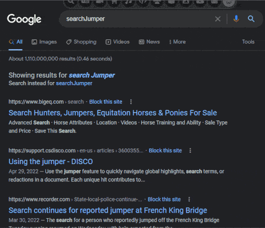
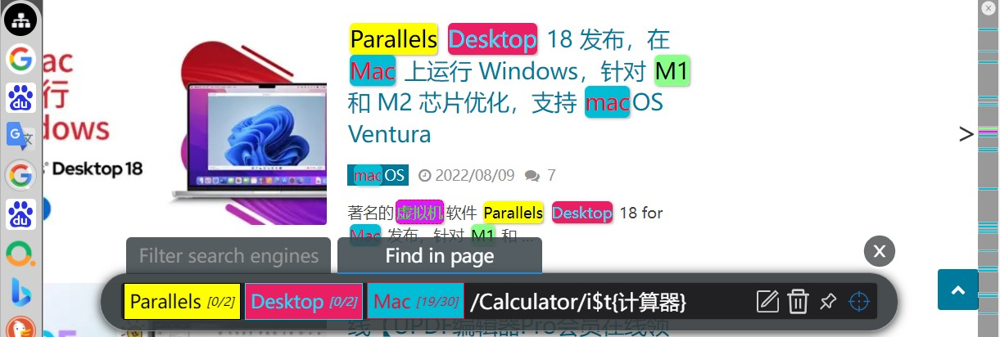

# [SearchJumper](https://chromewebstore.google.com/detail/hgepmblbgodbilmfdjkalkgofdcipkhh "Install from Chrome web store 搜尋引擎輔助增強瀏覽器插件，一键切换搜尋引擎，支援拖拽搜尋/劃詞搜尋/快捷鍵等。検索機能強化。検索ちゃん")  [💞Share your search engines](https://github.com/hoothin/SearchJumper/discussions/categories/search-engines?discussions_q=)

[](https://search.hoothin.com/)


> *Just a personal work, maybe not suit you.* 📖[**Guide**](https://search.hoothin.com/)

+ Build with React.js
+ UI: Material-UI
+ Icons: FontAwesome

## Install
| Install via [Chrome web store](https://chromewebstore.google.com/detail/hgepmblbgodbilmfdjkalkgofdcipkhh) | Install via [Firefox addons](https://addons.mozilla.org/firefox/addon/searchjumper/) | Install via [Greasyfork](https://greasyfork.org/scripts/445274) |
|---|---|---|
| [](https://chromewebstore.google.com/detail/hgepmblbgodbilmfdjkalkgofdcipkhh)                       | [](https://addons.mozilla.org/firefox/addon/searchjumper/)                                      | [](https://greasyfork.org/scripts/445274)                |



## Config page
[🔗**hoothin.github.io**](https://hoothin.github.io/SearchJumper/)

[🔗**search.hoothin.com**](https://search.hoothin.com/config/)

> You can also download the source code, double-click start.cmd to compile, then enter the config page through localhost:3000
> 
> 亦可下載源碼到本地后雙擊 start.cmd ，透過 npm 編譯后訪問 localhost:3000 進入配置

Please help with localizing this extension[[1](searchJumper.user.js#L654)][[2](src/index.js#L1386)] to the language you are familiar with!

 <details>
<summary><h3>Translation Contributors</h3></summary>
  Русский: <a href="https://github.com/RomanAleynikov">RomanAleynikov</a>
 </details>

## Features:
+ Fully open source without any privacy collection, spam or third-party libraries.
  > 完全開源，無任何隱私收集、廣告或者亂七八糟的第三方庫，所有數據均在本地，無任何服務器交互
+ Search for pictures, links, videos, audios, pages, etc. (**long press the right mouse** on the corresponding object)
  > 可以搜尋圖片、連結、視頻、音頻、頁面等（在相應對象上**長按右鍵**）
+ Support word search on any page (need to **long press the right mouse**, you can also change to swipe to call out immediately in the settings)
  > 支援任意頁面劃詞搜尋（需要**長按右鍵**，亦可在設置中改為劃選立即調出）
+ Support search by site
  > 支援站內搜尋
+ Shortcut keys (single key or key combination) to start search (such as alt+g Google search, which can be customized at will)
  > 可隨意使用快捷鍵（單個按鍵或者組合按鍵）開啟搜尋（比如 alt+g 谷歌搜尋，可隨意自定義）
+ Right-click the category icon to open the sites in batches
  > 滑鼠右鍵單擊類別圖標批量打開同一類別
+ Hold **`shift`** + left click on category icon to open batches in new window
  > 按住 **`shift`** 左鍵單擊類別圖標在新窗口批量打開
+ Hold **`ctrl`** + left click on category icon to open in background TAB
  > 按住 **`ctrl`** 左鍵單擊類別圖標以後臺標籤頁批量打開
+ Hold **`alt`** + left-click a category icon to batch open multiple separate windows
  > 按住 **`alt`** 左鍵單擊類別圖標以多個單獨窗口批量打開
+ Hold **`ctrl + shift`** + left click on category icon to open batches in incognito window
  > 按住 **`ctrl + shift`** 左鍵單擊類別圖標在隱身窗口批量打開
+ Hold **`alt + shift`** + left click on category icon to open batches embedding
  > 按住 **`alt + shift`** 左鍵單擊類別圖標批量嵌入打開
+ **`shift`** + left click on site icon to open in new window
  > 按住 **`shift`** 左鍵單擊站點以新窗口打開結果頁
+ **`ctrl`** + (left click/shortcut/drag) on site icon to open in background TAB
  > 按住 **`ctrl`** (左鍵單擊/快捷鍵/拖拽)站點以後臺標籤頁打開結果頁
+ **`alt`** + (left click/shortcut/drag) on site icon to preview in small window
  > 按住 **`alt`** (左鍵單擊/快捷鍵/拖拽)站點以小窗口預覽結果
+ **`ctrl + shift`** + (left click/shortcut/drag) single site/press shortcut key to open in incognito window.
  > 按住 **`ctrl + shift`** (左鍵單擊/快捷鍵/拖拽)站點以隱身窗口打開
+ Call search bar for input words to filter sites by shortcut key when select no words, press enter to search quickly, `ctrl` + enter to search without lock.
  > 沒有選擇文字或者圖片時透過喚出快捷鍵可喚出站點搜尋框，搜尋站點后按下回車可鎖定站點並輸入搜尋詞，再次回車使用第一個結果搜尋，ctrl+回車無需鎖定即可快捷打開，適用於靜態書簽。
+ Can set the category to be displayed only on the specified site through the regular rule
  > 可以透過正則設置類別僅在指定站點顯示
+ Right click on cute face to hide the toolbar
  > 右鍵點擊 小萌臉 徹底隱藏工具欄
+ Left click on cute face to open the configuration page
  > 左鍵點擊 小萌臉 打開配置頁
+ Support open with shortcut key, right click on the logo to close
  > 可隨意拖拽 小萌臉，並隨意選擇位置放置，例如上中，下中，左上，右上，上左，上右等
+ Support configuration export and quick sharing
  > 支援配置導出與快捷分享
+ Support middle button to open links in the background
  > 支援中鍵後台打開連結
+ Support custom css
  > 支援自定義樣式
+ Support full character encoding
  > 支援全字符編碼
+ Support Post, in-page post and non-jump post
  > 支援 Post、頁內 post 以及無跳轉 post
+ Comprehensive customization
  > 全面的自定義功能，詳見最下方【搜尋參數】
+ No 3rd party dependencies
  > 無第三方依賴庫
+ Self-expand current category
  > 自展開當前類別並提前
+ No tamper with the original page
  > 不篡改原始頁面
+ Drag to search with current category
  > 拖拽搜尋當前分類（文字/圖片/鏈接），内圈為當前分類前6個站點，外圈為最近使用的10個站點，可透過編輯第一個（文字/圖片/鏈接）分類來自定義内容

 <details>
<summary><h2>Screenshots</h2></summary>
  




 </details>

## Search params
| param | details | 詳述 |
| --- | --- | --- |
| `%s` | search keyword |🗒️ 搜尋關鍵詞 |
| `%S` | cached search keyword |🗒️ 最近一次的搜尋關鍵詞 |
| `%sl` | search keyword with lower case letters |🗒️ 小寫字母搜尋詞 |
| `%su` | search keyword with upper case letters |🗒️ 大寫字母搜尋詞 |
| `%u` | current website url | 🗒️ 當前網站 url |
| `%h` | current website host | 🗒️ 當前網站 host |
| `%t` | target src | 🗒️ 指向對象的 src |
| `%i` | base64 of target image | 🗒️ 指向圖片的 base64 |
| `%s.replace` | replace keywords with regexp, like %sr.replace(/[^\d]/g, "").replace(/(\d)/g, "$1 ") means replace raw keywords to numbers and then join all numbers with space, support %s %sl %sr %su %t %u |🗒️ 用正則替換搜尋關鍵詞，例如 %sr.replace(/[^\d]/g, "").replace(/(\d)/g, "$1 ") 代表提取原始關鍵詞中所有數字，並以空格分隔，支援  %s %sl %sr %su %t %u |
| `%p{params}` | post body, like %p{x=1&y=%s} | 🗒️ post 參數體，例如 %p{x=1&y=%s} |
| `%P{params}` | post without navigation | 🗒️ post 但不跳轉 |
| `%input{tips}` | input something, like %input{love who?,you} | 🗒️ 輸入占位，例如%input{請輸入您的三圍,90 55 90} |
| `#p{params}` | post in page, like #p{<i>#input</i>=%u<b>&</b>sleep(500)<b>&</b>click(<i>.submit</i>)}, means: input current url to "#input", then wait for 500ms, then click ".submit". use \\& \\= instead of & = in content | 🗒️ 頁内 post，可在頁面之内使用【css選擇器】填寫參數提交查詢，適用於不開放GET/POST接口的網站，例如 #p{<i>#input</i>=%u<b>&</b>sleep(500)<b>&</b>click(<i>.submit</i>)}, 代表在"#input"内輸入指定url，然後等待500毫秒，最後點擊".submit"。可在内容中使用 \\& \\= 來 表示 & = |
| `["siteName1","siteName2"]` | batch open by site name you've created | 🗒️ 透過你已經創建的站點名批量打開，例如 \["雅虎搜尋","谷歌搜尋"\] |
| `%element{}` | query element for innerText from selector or xpath, like %element{.mainTitle} | 🗒️ 透過 css 選擇器或 xpath 抓取元素並返回文字内容，例如 %element{.mainTitle} |
| `%element{}.prop()` | return prop value for queried element, like %element{.mainTitle}.prop(href) %element{.mainTitle}.prop(innerHTML) | 🗒️ 獲取抓取到元素的屬性值，例如 %element{.mainTitle}.prop(href) %element{.mainTitle}.prop(innerHTML) |
| `%element{}.replace()` | replace, same as above, like %element{.mainTitle}.prop(href).replace(/https/i,"") | 🗒️ 正則替換，例如 %element{.mainTitle}.prop(href).replace(/https/i,"") |

## PopClip extension for SearchJumper
``` yaml
#popclip extension for SearchJumper
name: SearchJumper
icon: search filled S
url: https://search.hoothin.com/all#***
```
Select the above text, PopClip will offer an "Install Extension" action. Click it.

+ `https://search.hoothin.com/all?kw=keywords&engine=someengine` means search keywords with search engine named someengine and open in new tab.
+ `https://search.hoothin.com/all?kw=keywords&engine=someengine&self=1` means search keywords with search engine named someengine and open in current tab.

---

## Search engine examples 搜尋引擎規則範例

+ Open link in the text, display only when a link is detected 打開文字中的鏈接，僅當檢測到鏈接時顯示
``` json
{
  "name": "打開文字中的鏈接",
  "url": "%sr.replace(/(点|。)/g,\".\").replace(/[^\\s\\w\\-_\\.~!\\*';:@&=\\+\\$,\\/\\?#\\[\\]%]/g,\"\").replace(/https:\\/\\/pan\\.baidu\\.com\\/s\\//,\"\").replace(/.*([\\s:：]|^)(1[a-z_0-9]{22,})[\\s\\S]*?\\b([a-z0-9]{4}\\b|$).*/i,\"https://pan.baidu.com/s/$2?pwd=$3\").replace(/ /g,\"\").replace(/^/,\"http://\").replace(/^http:\\/\\/(https?:)/,\"$1\")",
  "kwFilter": "\\w.*[\\.点。].*\\w|1[a-zA-Z0-9]{22,}"
}
```
+ Automatically send target text to other device like mobile phone 自動發送選中文字到手機
``` json
{
  "name": "發送到手機",
  "url": "https://s.hoothin.com/#p{wait(x-peer)&call(document.querySelector('x-peer').dispatchEvent(new Event('contextmenu')))&#textInput=%s&click(#textInput+div>button)}"
}
```
+ Split by line and paste into the current input box in order 按行分割後依次粘貼到當前輸入框
``` json
{
  "name": "⌨️ 按行輸入",
  "url": "#p{@=%s[]}"
}
```
+ Currency conversion / USD to RMB, show tips when the mouse is hovering
``` json
{
  "name": "💲USD to RMB",
  "url": "showTips:https://api.exchangerate.host/convert?from=USD&to=CNY&amount=1 \n{name}<br/><i>%s USD = {json.result|*%s.replace(/\\D/,'')} RMB</i>",
  "kwFilter": "\\d\\$|\\$\\d"
}
```
+ Currency conversion of various countries 各國貨幣轉換 **javascript is effective only at userscript**
``` json
{
  "name": "貨幣轉換",
  "url": "javascript:fetch(`https://api.exchangerate.host/convert?from=%input{From currency/US Dollar/Euro/Japanese Yen/China Yuan,USD/EUR/JPY/CNY}&to=%input{Target currency/US Dollar/Euro/Japanese Yen/China Yuan,USD/EUR/JPY/CNY}&amount=%sr.replace(/\\D/g,\"\")`).then(r=>r.json()).then(r=>prompt(`${r.date} Exchange rate by the European Central Bank\\n${r.query.amount.toLocaleString()} ${r.query.from} =`,`${r.result.toLocaleString()} ${r.query.to}`)).catch(alert);"
}
```
+ Miles to kilometers and show in tips 英里轉公里並顯示為 tips
``` json
{
  "name": "📏 英里轉公里",
  "url": "showTips:let s=\"%sr\".match(/(\\d+)(英里|英?哩|mi(le)?)/)[1];let km=(s*1.609344).toFixed(2);return `<i>${s} mi = ${km} km</i>`;",
  "kwFilter": "\\d+\\s*(英里|英?哩|mi(le)?\\b)"
}
```
+ Preview Japan AV 框選番號預覽AV such as ABW-345
``` json
{
  "name": "💞 AV預覽",
  "url": "showTips:https://www.javbus.com/%sr.replace(/^(\\w+?)[\\-_]?(\\d+)$/,\"$1-$2\") \n<span style='font-size:22px;line-height:1.2;'>{h3}</span>\n<p style=\"margin: 0; font-size: 18px; font-weight: normal;\">{.info>p:nth-child(2)}</p>\n<p style=\"margin: 0; font-size: 18px; font-weight: normal;\">{.info>p:nth-child(6)}</p>\n<p style=\"margin: 0;\">{.genre a|<mark style=\"white-space: nowrap;margin: 5px; font-size: 16px; border-radius: 5px; padding: 2px; box-shadow: 0px 0px 10px 0px #000;\">()</mark>}</p>\nimg|src}' referrerpolicy='no-referrer'/>",
  "kwFilter": "^[0-9a-zA-Z]+[\\-_]?\\d+$"
}
```
+ Show Romaji of japanese 顯示日語對應羅馬音/羅馬字
``` json
{
    "name": "🗻 Japanese romaji",
    "url": "showTips:https://translate.googleapis.com/translate_a/single?client=gtx&dt=t&dt=bd&dj=1&dt=ex&dt=ld&dt=md&dt=qca&dt=rw&dt=rm&dt=ss&dt=at&sl=ja&tl=en&q=%s\n<h3 style='margin: 0;'>{name}</h3>\n{json.sentences.all.trans}\n<br>\n<font style='display: block;' color='antiquewhite'>{json.sentences.all.orig}</font>\n<font style='display: block;' color='yellow'>{json.sentences.-1.src_translit}</font>\n🔈<a style=\"color:#f9690e;\" href=\"#\" onclick='var msg = new SpeechSynthesisUtterance(\"\");msg.volume = 1;msg.rate = 1;msg.pitch = 1;msg.lang = \"ja\";msg.text=`%sr`;window.speechSynthesis.speak(msg);'>Read</a>",
    "kwFilter": "[\\u3040-\\u309F\\u30A0-\\u30FF]"
}
```

---
 <details>
<summary><h2>Add search engines quickly 快速添加搜尋引擎</h2></summary>

+ Add with shortcut key on current page 透過快捷鍵快速在當前頁面添加
> Click search input box with `ctrl + shift` 按住 `ctrl + shift` 點擊當前頁面中的搜尋輸入框即可

+ Search on mycroftproject.com and add  在 mycroftproject 上搜尋別人編輯好的站點並點擊導入
> Click the searchJumper face icon in sites list on mycroftproject 點擊 mycroftproject 上站點列表裏的搜尋醬圖標即可

 </details>

---
 <details>
<summary><h2>Auto highlight rule examples 自動高亮詞規則範例</h2></summary>

Highlight all avID on t66y 在草榴上高亮番號
``` json
{
    "/^https://t66y\\.com/htm_data//i": {
        "sep": "#",
        "words": [
            "/(^|\\s)([a-z]\\w+\\-?|\\d{5,}\\-)\\d{2,}($|\\s)/i$s{unset;border-radius:unset;border-bottom:5px dotted red;}$t{@popup}"
        ]
    }
}
```
+ Effect on the site matched RegExp `^https://t66y\\.com/htm_data/` with case ignore
 >匹配到草榴網址的正則 `^https://t66y\\.com/htm_data/` 后生效，不區分大小寫
+ Split by "#" as there is space in the keyWords under
 >以#分隔，因爲下面的關鍵詞中有空格
+ Search words according to the regular pattern at first, then add style "background:unset;border-bottom:5px dotted red;" to the highlighted words, finally add the feature of hovering the mouse to pop up the search box
 >首先根據正則 "[0-9a-zA-Z]+\\-\\d+" 查找番號，然後為高亮詞添加 style "background:unset;border-bottom:5px dotted red;"，最後添加鼠標懸浮彈出搜索彈框的特性

Hide user by target id on xxxx.com 在某個網站上根據給定的用戶名或者用戶 ID 屏蔽元素
``` json
{
    "@someUserID": "/12345|54321/l",
    "@someUserName": "/jack|adam|rose/i",
    "/^https://xxxx\\.com/yyyy//i": {
        "sep": "|",
        "words": [
            "@someUserID$p{0}",
            "@someUserName$p{0}"
        ]
    }
}
```
+ Effect on the site matched RegExp `^https://xxxx\\.com/yyyy/` with case ignore
 >網址匹配到正則 `^https://xxxx\\.com/yyyy/` 后生效，不區分大小寫
+ Split by "|"
 >以|分隔
+ Search links by @someUserID to hide (l after RegExp means link), and search words by @someUserName to hide. 
 >查找設定在模板 @someUserID 中的用戶 ID （正則后的 l 代表篩選連結），然後隱藏連結中含有此 ID 的元素，同時查找設定在模板 @someUserName 中的用戶名並隱藏元素

 </details>

---
 <details>
<summary><h2>Filter engines to search 篩選引擎並搜尋</h2></summary>

+ Call by global shortcut key, Input keywords of site name to filter sites, support glob with "? \*" 透過全局快捷鍵喚出，輸入站點名稱的關鍵詞來篩選，支援 “? \*” 通配符
+ Enter to lock filter and input words to search by click icon or another press of enter 回車鎖定篩選，輸入文字并且點擊站點圖標或者再次回車來進行搜尋


 </details>

---
 <details>
<summary><h2>Call SearchJumper by event 透過鼠標手勢調用搜尋醬</h2></summary>

+ Search by site name 以站點名調用搜尋
``` javascript
// search by google
const siteName = 'Google search';
const searchJumperEvent = new CustomEvent('searchJumper', {
  detail: {
    action: 'search',
    name: siteName
  }
});
document.dispatchEvent(searchJumperEvent);
```
+ Show search bar 顯示搜尋條
``` javascript
const searchJumperEvent = new CustomEvent('searchJumper', {
  detail: {
    action: 'show'
  }
});
document.dispatchEvent(searchJumperEvent);
```
+ Show All-mode 顯示所有模式
``` javascript
const searchJumperEvent = new CustomEvent('searchJumper', {
  detail: {
    action: 'showAll'
  }
});
document.dispatchEvent(searchJumperEvent);
```
+ Search by second site of current type and open in new window 使用當前分組的第二個站點搜尋並在小窗打開結果
``` javascript
const siteOrder = 2;
let currentSite = document.querySelector(`.search-jumper-type:not(.search-jumper-hide)>a:nth-of-type(${siteOrder})`);
if (currentSite) {
  const searchJumperEvent = new CustomEvent('searchJumper', {
    detail: {
      action: 'search',
      name: currentSite.dataset.name,
      key: {altKey:true}
    }
  });
  document.dispatchEvent(searchJumperEvent);
}
```
+ Search by site of current type in background tab 使用當前分組的站點搜尋並在後臺標籤頁打開結果
``` javascript
const searchJumperEvent = new CustomEvent('searchJumper', {
  detail: {
    action: 'search',
    key: {ctrlKey:true}
  }
});
document.dispatchEvent(searchJumperEvent);
```
+ Search by second site of current type in incognito tab 使用當前分組的第二個站點搜尋並在隱身標籤頁打開結果
``` javascript
const siteOrder = 2;
const searchJumperEvent = new CustomEvent('searchJumper', {
  detail: {
    action: 'search',
    index: siteOrder,
    key: {ctrlKey:true, altKey:true}
  }
});
document.dispatchEvent(searchJumperEvent);
```
 </details>

---
 <details>
<summary><h2>Download all video with lux 使用 LUX 下載全網視頻</h2></summary>


 <details>
<summary>Step by step of One-click video download configuration</summary>

+ Download [Lux](https://github.com/iawia002/lux/releases)
+ Download [ffmpeg](https://www.gyan.dev/ffmpeg/builds/ffmpeg-git-essentials.7z)
+ Add site under group which "Effect on page" on your SearchJumper
+ Click "Call local application" under "Edit site"
+ Input command like `"D:\Program Files\lux\lux.exe" %u`, then submit.
+ Open and import the reg file.
+ Right click with ctrl key, click Lux.
 </details>
 
 <details>
<summary>一鍵視頻下載配置方法（B站為例）</summary>

+ 下載[BBDown](https://github.com/nilaoda/BBDown)
+ 下載[ffmpeg](https://www.gyan.dev/ffmpeg/builds/ffmpeg-git-essentials.7z)，解壓並且複制\bin\ffmpeg.exe
+ 將BBDown.exe 與 ffmpeg.exe 放置於同一文件夾，記錄該路徑，例如 `D:\Program Files\BBDown`
+ 在你的搜尋醬“當前網頁”分類新增站點
+ 點擊“編輯站點”最下方的“添加自定義本地應用調用”
+ 調用命令處填入`"D:\Program Files\BBDown\BBDown.exe" %u -tv`，點擊生成註冊表補丁
+ 此時會自動生成註冊表補丁，點擊導入，並且保存編輯站點
+ 在 bilibili 視頻播放頁面按住 ctrl 點擊右鍵，點擊BBDown即可下載
+ 其他視頻下載工具（例如lux、you-get、yt-dlp等）同理，可自行編輯。
 </details>
 
Registry patch to call lux by SearchJumper 搜尋醬調用本地程式的注冊表補丁

``` ini
Windows Registry Editor Version 5.00

[HKEY_CLASSES_ROOT\lux]
@="URL:lux Protocol"
"URL Protocol"=""

[HKEY_CLASSES_ROOT\lux\DefaultIcon]
@="cmd.exe,1"

[HKEY_CLASSES_ROOT\lux\shell]

[HKEY_CLASSES_ROOT\lux\shell\open]

[HKEY_CLASSES_ROOT\lux\shell\open\command]
@="cmd /c set m=%1 & call set m=%%m:lux://=%% & d: & cd \"D:\\Program Files\\lux\" & call lux.exe %%m%% & pause"
```
Modify path by yourself 自行修改補丁中的目錄，保存爲 lux.reg，雙擊導入注冊表。

Open the page of video and download with `lux://%u` 完畢之後即可新建站點使用 `lux://%u` 調用 lux 下載當前網頁視頻
 </details>

---
 <details>
<summary><h2>Sync by webdav 透過 webdav 同步引擎配置與高亮規則</h2></summary>

+ webdav 伺服器需要支援自設 cors
+ 也可以自己架設 webdav 伺服器，方法如下
  - 下載 [webdav server](https://github.com/hacdias/webdav/releases)
  - 創建配置文件 `config.yml`，內容如下：

```
address: 伺服器地址
port: 伺服器端口
cors:
  enabled: true
  credentials: true
  allowed_headers:
    - '*'
  allowed_hosts:
    - https://hoothin.github.io
  allowed_methods:
    - '*'
  exposed_headers:
    - Content-Length
    - Content-Range
users:
  - username: 用戶名
    password: 密碼
    scope: webdav 同步文件夾路徑
    modify: true
```
 </details>
 
---
 <details>
<summary><h2>Batch open modes 多種批量打開方式</h2></summary>
  
+ **`shift`** + click category icon

  
+ **`alt + shift`** + click category icon

  
+ **`alt`** + click category icon


 </details>
